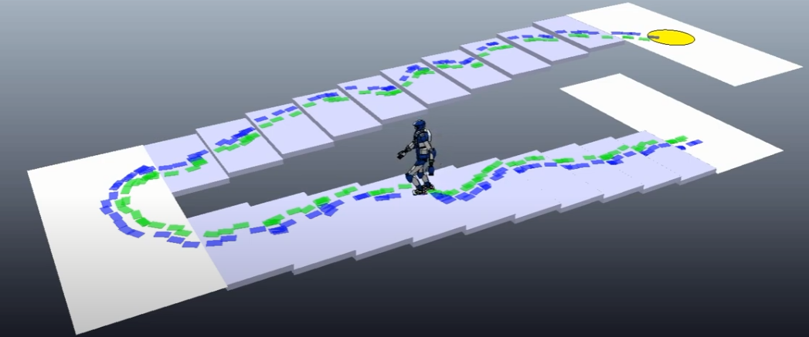
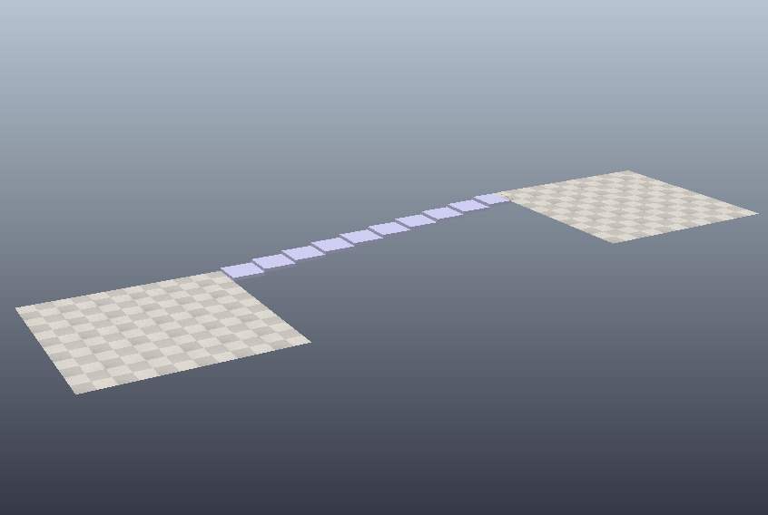
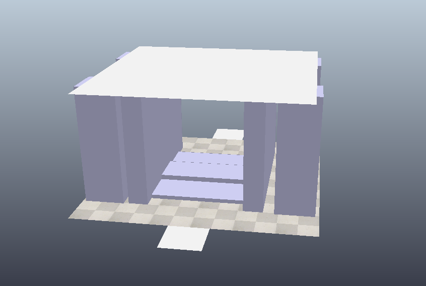
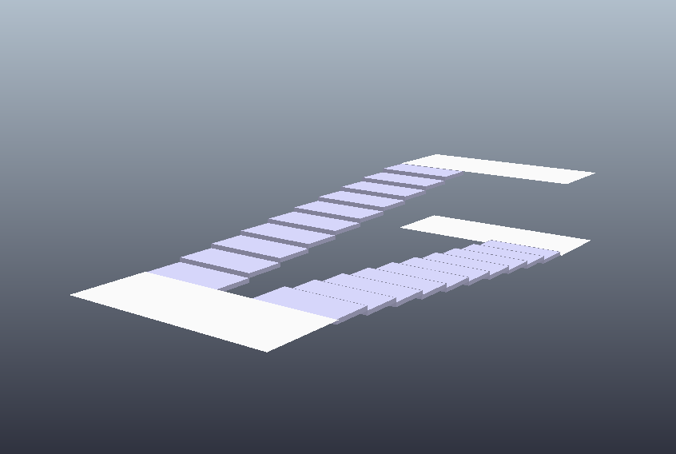
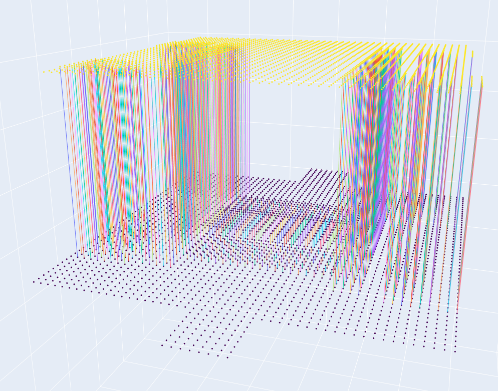
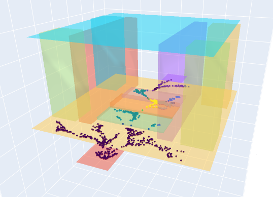
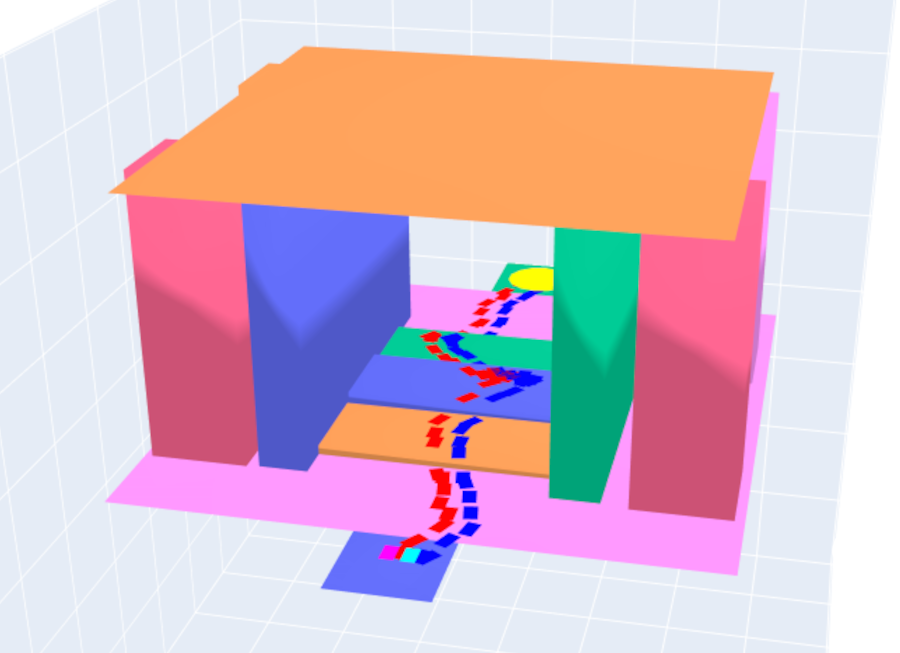

# Autonomous humanoid navigation in multi-floor environments
<div align="center">  </div> 

Starting from recent papers novelties, we have extended the previously proposed methodologies for navigation in complex uneven terrains [ [Ferrari et al. (2019)](https://ieeexplore.ieee.org/document/8796196) ]  by developing a footstep planner based on a randomized algorithm for an autonomous humanoid robot in a multi-floor environment. This was implemented by leveraging a multi-level surface map [ [Triebel et al. (2006)](https://ieeexplore.ieee.org/document/4058725) ]. 

Tests have been carried out on three different environments, each of them with peculiar characteristics, in order to assess the correct behaviour.

<div align="center"> 
 

 </div> 

Finally, the results were validated with simulations on CoppelliaSim using a gait generator based on IS-MCP for computing the CoM trajectory.

<div align="center">  </div> 

## Setup
```bash
pip3 install -r requirements.txt
```

# CoppeliaSim plugin
Translate a scene in Coppelia into a file containing all the useful information about the objects in the scene. 

It is available [here](https://github.com/Matteo-Sapienza/MLSM).

# Multi Level Surface Map
It is an extrension of the popular Elevation Map that allows to represent environments composed by multiple layers.

<div align="center">  </div>

It exploits the information taken from the scene to build a map that stores in its cells a list of tuples, one for each object above the considered cell. 
Each tuple contains the height of the upper surface and a depth value representing the thickness of the object belonging to the considered cell.

# Offline Motion Planning
RRT to search for a path to the Goal region.

<div align="center"> 
 
 
</div>

More examples can be found in the [outputs](outputs/) folder, each with its plot.

# How to run
To launch the planner with default settings:
```bash
./main.py --world data/world_of_stairs.json --time-max 10000 --resolution 0.02
```
- **world**: path to the json containing all the info about the objects in the scene
- **time-max**: number of iterations of the RRT
- **resolution**: size for the world discretization

Use the **help** option for more details.


# Convert footstep plan
To convert the `.tsv` footstep plan in order to be published as ROS topic:
```bash
./convert-tsv-footstep-plan.py --input TSV_FILE_PATH --output TXT_FILE_PATH
```
